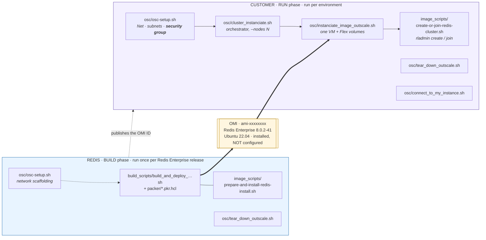
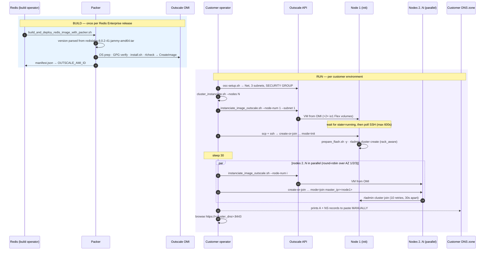
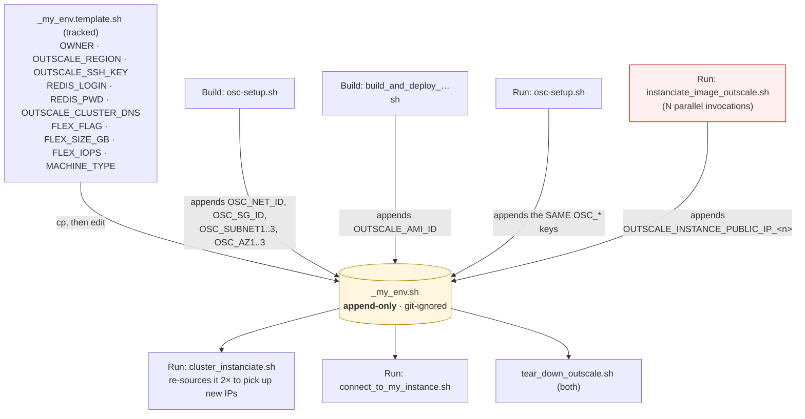
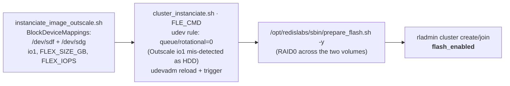
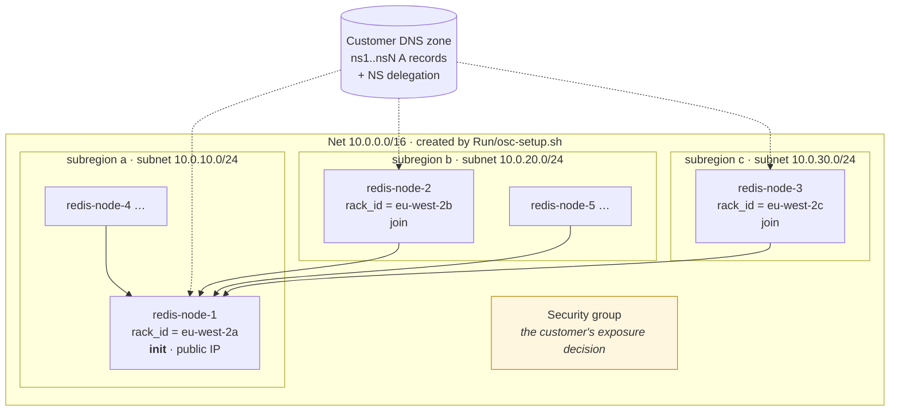

# Architecture — end-to-end: BUILD (Redis) → OMI → RUN (customer)

Covers **both** repositories, because neither makes sense alone:

| Repo | Path | Run by | Produces |
|---|---|---|---|
| `OSC-RedisEnterprisePacker-Build` | `~/Projects/OSC-RedisEnterprisePacker-Build` | **Redis** | a tagged Outscale OMI containing Redis Enterprise, installed but unconfigured |
| `OSC-RedisEnterprisePacker-Run` | `~/Projects/OSC-RedisEnterprisePacker-Run` | **the customer** | a live N-node Redis Enterprise cluster launched from that OMI |

Verified against `Build@fe7c72f` and `Run@10d933d` (2025-09-30). Repo-specific detail for Build
stays in `docs/architecture/overview.md`; this document is the joint view.

## 1. Division of labour — and what it settles

**This settles the security-group question.** The customer-facing security group — and therefore
the decision of *which CIDRs may reach SSH, the Cluster Manager UI, the REST API and the
database ports* — is created by **`Run/osc/osc-setup.sh`**, at deployment time, by the
customer. It is **not** a Build concern:

- Build's own security group is never used by the build. The Packer Outscale plugin creates
  and destroys its **own temporary security group** for the build VM (confirmed in
  `build_scripts/packer.out`). Build's `osc-setup.sh` is therefore near-dead code — see
  finding **R-01** in `docs/findings.md`.
- `Run/osc/osc-setup.sh` is **byte-identical** to `Build/osc/osc-setup.sh`
  (`diff` → no output), and `tear_down_outscale.sh` differs by a single `sleep 15`. The
  network scaffolding is duplicated wholesale across the two repos.

So "parameterise the source CIDR" is a **Run** task. In Build it should simply be deleted.

## 2. End-to-end sequence

Two things to note in the Run flow:

- **DNS is manual.** The script only *prints* the required `A` and `NS` records; the customer
  pastes them into their zone. Redis Enterprise needs each node to be an `NS` for the cluster
  FQDN so that database endpoints (`redis-12000.<cluster>.<domain>`) resolve — that is why
  Build frees UDP 53 (ADR 0007). Until DNS is published, the cluster is only reachable by IP.
- **Node 1 is sequential, nodes 2..N are parallel.** `10d933d` made this change and claims a
  consistent ~5 min regardless of node count, replacing a fixed `sleep` with real SSH polling.

## 3. The shared contract: `_my_env.sh`

Both repos communicate through one git-ignored shell file that every script `source`s and
several scripts **append** to. It is the backbone of the design and its main fragility.

| Key | Written by | Read by |
|---|---|---|
| `OWNER`, `OUTSCALE_REGION`, `OUTSCALE_SSH_KEY` | operator | every script |
| `OSC_NET_ID`, `OSC_IGW_ID`, `OSC_RTB_ID`, `OSC_SG_ID`, `OSC_SUBNET1..3`, `OSC_AZ1..3` | `osc-setup.sh` (either repo) | teardown, `instanciate_image_outscale.sh` |
| `OUTSCALE_AMI_ID` | Build's build wrapper | `instanciate_image_outscale.sh` |
| `REDIS_LOGIN`, `REDIS_PWD`, `OUTSCALE_CLUSTER_DNS` | operator (Run only) | `cluster_instanciate.sh` |
| `FLEX_FLAG`, `FLEX_SIZE_GB`, `FLEX_IOPS`, `MACHINE_TYPE` | operator (Run only) | **declared but overridden** — see F-04 |
| `OUTSCALE_INSTANCE_PUBLIC_IP_<n>` | `instanciate_image_outscale.sh`, **concurrently** | `cluster_instanciate.sh`, `connect_to_my_instance.sh` |

The red box is the race: during the parallel phase, N subshells each append to this file while
`cluster_instanciate.sh` re-`source`s it. No locking (finding **F-01**).

## 4. Redis Flex / Auto Tiering — it *is* implemented, in Run

This corrects an earlier reading of the Build repo in isolation. `flash_enabled` in
`create-or-join-redis-cluster.sh` is **not** orphaned:

The build image deliberately prepares **nothing** for flash — correct, since the volume
geometry is a deployment choice. Commit `34c7939` ("flash not fully enabled") predates
`699110c` "Flex working on outscale" (2025-09-10), so the historical complaint is resolved.
Build's TODO T-17 is amended accordingly.

## 5. Cluster topology produced

- Nodes are placed **round-robin over the three subregions** (`rr_idx`), and each passes its
  subregion as `rack_id`, with `rack_aware` on the `create`. Redis Enterprise then keeps master
  and replica shards in different racks.
- `--nodes` must be **odd, 3–35** — odd for quorum. Enforced.
- All nodes get **public IPs** (`MapPublicIpOnLaunch`), and `external_addr` is set to the public
  IP. There is no private-subnet or bastion topology on offer (finding **F-10**).

## 6. Properties and consequences

| Property | Consequence |
|---|---|
| **Build produces an unconfigured image** | One OMI serves every customer; nothing customer-specific is baked in. The price: the image alone is not a cluster, and Run must stay in step with it. |
| **`_my_env.sh` is the API between phases** | Zero-friction handoff, but no schema, no validation, no locking, and append-only semantics that shadow earlier runs and orphan cloud resources. |
| **Network scaffolding duplicated byte-for-byte** | Two copies of `osc-setup.sh`/`tear_down_outscale.sh` (one already drifted by a `sleep 15`). A CIDR fix applied in one repo silently misses the other. |
| **`create-or-join-redis-cluster.sh` duplicated byte-for-byte** | Only Run executes it; the Build copy is dead. A security fix must land in Run, and the dead copy should go. |
| **Exposure is a Run/customer decision** | Correct separation. But the shipped default is `0.0.0.0/0` with no parameter, so a customer who does not edit the script inherits full internet exposure (finding **F-02**). |
| **Admin credentials travel by command line and land in logs** | The password is interpolated client-side into an `ssh` heredoc, passed as `argv[3]` to a `sudo` command on the node, echoed by the remote script into `/var/log/redis-enterprise-init.log`, and printed to the operator's terminal at the end. Four exposure points for one secret (findings **F-05**, **F-06**). |
| **Host-key verification disabled everywhere** | `StrictHostKeyChecking=no` + `UserKnownHostsFile=/dev/null` on every `ssh`/`scp`, over the same channel that carries the admin password. Combined with Build's missing host-key regeneration, there is no authentication of the node at all (finding **F-07**). |
| **DNS is manual** | The cluster is unusable by FQDN until the customer edits their zone, and nothing verifies they did. Acceptable, but it is the one un-automated step in an otherwise end-to-end flow. |
