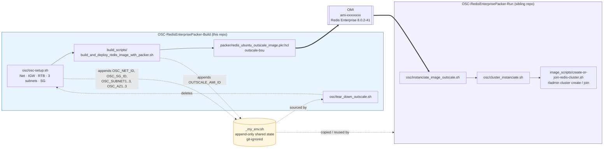
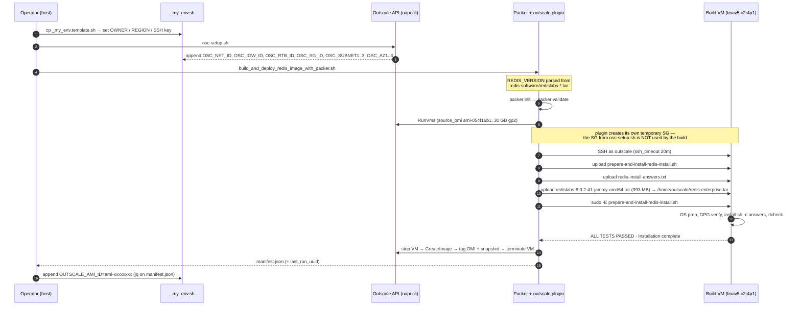
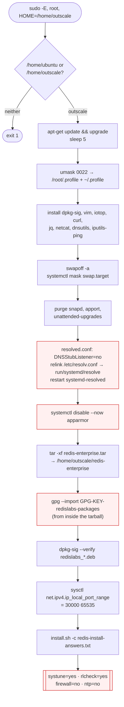
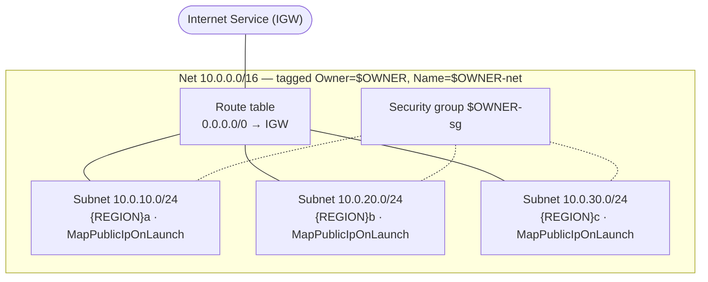

# Architecture — OSC-RedisEnterprisePacker-Build

**Verified against** HEAD `fe7c72f` and the last real build log (`build_scripts/packer.out`,
2025-11-25 → `eu-west-2:ami-06426132`).

## 1. Two-repo split



The interface between the two repos is a **file**, not an API: `_my_env.sh`. That is the
single most important architectural fact — and its weakest point (see §6).

## 2. Build sequence



**Note step 9 — and this is a gap, not a design.** The Packer Outscale plugin provisions its *own*
throwaway security group for the build VM, **and the build runs outside the Net entirely**
(`"SubnetId":""` in `packer.out`). `osc-setup.sh`'s security group is consumed by the **Run** phase, not by the
build. The intended posture is for the build to run **inside** the Net that `osc-setup.sh` creates — the
`outscale-bsu` builder supports `subnet_id`, `net_id`, `subregion_name` and
`associate_public_ip_address` — but the HCL never sets them, so the Net, subnets and security
group are provisioned and then ignored. Tracked as **T-41**; PR 5 of
`docs/plan/build-remediation.md` wires it up. Until then, do not assume changes to
`osc-setup.sh`'s security group affect the build — they cannot.

## 3. Inside the image — what `prepare-and-install-redis-install.sh` does



Red boxes are the deliberate weakenings — each has an ADR (`0005`–`0008`) and a TODO entry.

### Why the resolved-stub / port-range steps exist

Redis Enterprise runs its own DNS/mDNS responder on **UDP 53 and 5353** for cluster and
database name resolution. Ubuntu's `systemd-resolved` stub listener binds `127.0.0.53:53` and
collides with it — hence `DNSStubListener=no` plus relinking `/etc/resolv.conf` to the real
resolved-managed file. Widening `ip_local_port_range` to `30000-65535` keeps the kernel from
handing out ephemeral ports that Redis Enterprise reserves (database `10000-19999`, shard
`20000-29999`, internode `3333-3355`). Both are documented Redis requirements
([port configurations](https://redis.io/docs/latest/operate/rs/networking/port-configurations/)).

## 4. Network topology created by `osc-setup.sh`



Three AZs with rack-awareness in mind (`-Run` passes the subregion as `rack_id`). All subnets
are **public** — nodes get public IPs and Redis Enterprise's `external_addr` is set from them.
There is no NAT gateway and no private subnet tier.

### Security group rules, cross-checked against the Redis port matrix

Source of truth: [Network port configurations](https://redis.io/docs/latest/operate/rs/networking/port-configurations/).

| Port(s) | Proto | SG source | Redis "connection source" | Verdict |
|---|---|---|---|---|
| 22 | tcp | `0.0.0.0/0` | n/a (OS) | 🟠 Required for operator access; source should be a bastion/operator CIDR |
| 8001 | tcp | `0.0.0.0/0` + `10.0.0.0/8` | Internal, External | 🟡 Required by clients; source should be the client CIDR |
| 8070 | tcp | `0.0.0.0/0` | External | 🟡 Required by external monitoring; source should be the monitoring CIDR |
| 8080 | tcp | `0.0.0.0/0` | Internal, External, A-A | 🔴 **Cleartext REST API — optional, `9443` is its TLS twin. Drop it (T-40).** |
| 3346 | tcp | `0.0.0.0/0` + `10.0.0.0/8` | Internal, External, A-A | 🟡 Required (REST / node bootstrap); narrow the source |
| 8443 | tcp | `0.0.0.0/0` + `10.0.0.0/8` | Internal, External | 🟡 Required (admin UI over TLS); source should be an operator CIDR |
| 9443 | tcp | `0.0.0.0/0` + `10.0.0.0/8` | Internal, External, A-A | 🟡 Required (REST over TLS); source should be an operator CIDR |
| 10000-10049, 10051-19999 | tcp | `0.0.0.0/0` + `10.0.0.0/8` | Internal, External, A-A | 🟡 **Required — this is how applications reach a database.** Source should be the client CIDR |
| 53, 5353 | udp | `0.0.0.0/0` + `10.0.0.0/8` | Internal, External | 🟠 Required for cluster/database name resolution; but `0.0.0.0/0` adds a reflection/amplification vector — narrow to the client CIDR |
| 20000-29999 | tcp | `10.0.0.0/8` | Internal | 🟡 Correct role, over-broad CIDR |
| 1968, 3333-3345, 3347-3349, 3350-3354, 3355, 36379 | tcp | `10.0.0.0/8` | Internal | 🟡 Correct role, over-broad CIDR |
| 8002, 8004, 8006, 8071, 9080, 9081, 9082, 9091, 9125, 10050 | tcp | `10.0.0.0/8` | Internal | 🟡 Correct role, over-broad CIDR |
| **8444** | tcp | *absent* | Internal (web proxy ↔ cnm_http/cm) | 🟡 **Missing** |
| **3357** | tcp | *absent* | Internal | 🟡 **Missing** |
| **8000** | tcp | *absent* | Internal metrics | 🟡 **Missing** |

**Reading the verdict column correctly:** every port here is required by Redis Enterprise, and the
ones marked *External* genuinely must be reachable **by clients** — that is how applications use a
database and how an operator reaches the UI and API. The finding is not the port list; it is that
the **source CIDR is hardcoded to `0.0.0.0/0`** with no way for the customer to narrow it. Whether
these VMs face the internet at all is the customer's decision, and for a SecNumCloud deployment it
is very likely *no* (TODO T-21).

Three genuine defects remain: the cleartext REST API `8080` is opened although its TLS twin `9443`
is already present and `8080` is optional (T-40); the "internal" rules allow `10.0.0.0/8` where the
Net is `10.0.0.0/16` (T-26); and `8444`, `3357` and `8000` are missing from the internal rules (T-29).

Remember too that **this security group is Run-phase scaffolding** — the Packer plugin builds with
its own throwaway SG (§2, step 9), so nothing here affects the image. The durable version of this
rule set lives in `OSC-RedisEnterprisePacker-Run`.

## 5. Teardown order

`tear_down_outscale.sh` reverses creation, because Outscale refuses to delete a resource that
is still referenced:

```
VMs in the Net  →  default route  →  route-table links  →  route table
              →  security group  →  Internet Service (unlink, then delete)
              →  subnets  →  Net
```

Every destructive call is suffixed `|| true` so a partially-created environment still tears
down. The two exceptions are the `ReadRouteTables`/`UnlinkRouteTable` calls, which fail hard on
an API error — and which are also the two calls that forget `--profile`.

## 6. Design consequences worth knowing

| Property | Consequence |
|---|---|
| **`_my_env.sh` is append-only shared state** | No locking, no schema, no validation. Re-running a script silently shadows the previous run and orphans its cloud resources. The single biggest fragility in the design (`docs/adr/0004`, TODO T-01). |
| **Runtime config deliberately absent from the image** | One OMI serves every customer; the price is that the image alone is not a working cluster and `-Run` must be kept in step with it. |
| **No IaC state** | Nothing reconciles desired vs actual. `osc-setup.sh` always creates; `tear_down` always deletes by ID. Terraform/OpenTofu was rejected on purpose (`docs/adr/0004`). |
| **Base OMI pinned by raw ID** | `ami-054f16b1` is region-specific (eu-west-2) and will eventually be deregistered by Outscale, breaking the build. There is no data-source lookup by name. |
| **`apt-get upgrade` unpinned** | Every rebuild picks up whatever Ubuntu ships that day. Good for patching, bad for bit-for-bit reproducibility. |
| **`image_scripts/create-or-join-redis-cluster.sh` duplicated** | Byte-identical in both repos; only `-Run` executes it. Two copies will drift. |
